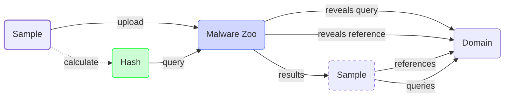

# Domain

## Overview

<div class="grid cards" markdown>
-   :octicons-book-16:{ .lg .middle } __Definition__

	<span style="font-size:0.9em;">
	A [fully qualified domain name (FQDN)](https://en.wikipedia.org/wiki/Fully_qualified_domain_name) is the technical term for what are typically called domains (e.g., `google.com`) and subdomains (e.g., `drive.google.com`).
	</span>

-   :octicons-bug-16:{ .lg .middle } __Usecase__

	<span style="font-size:0.9em;">
    Threat actors acquire FQDNs and configure them to resolve to servers they control. This allows them to to direct phishing victims to FQDNs which resolve to malicious landing pages, and allow malware-infected devices to send an initial DNS resolution request for FQDNs associated with C&C servers.
	</span>
</div>

<div class="grid cards" markdown>
-   :octicons-eye-16:{ .lg .middle } __Example__

	<span style="font-size:0.9em;">
    `realbumblebee[.]net`, `recentbee[.]net`, and `currentbee[.]net` were domains that resolved to [Cobalt Strike](https://www.cobaltstrike.com/) C&C servers operated by the threat actor known as Black Basta.[^1]
	</span>
</div>

<div class="grid cards" markdown>
-   :material-globe-model:{ .lg .middle } __Pivot Map__
	```mermaid
	flowchart LR
		classDef primary stroke-width: 2px
		classDef secondary stroke-dasharray: 5 5
		
		%% define nodes
		IP_ADDRESS(IP Address)
		DOMAIN(Domain):::primary
		DOMAIN_(Domain):::secondary
		TLS_CERT(TLS Certificate)
		SAMPLE(Sample)
		
		%% define edges
		DOMAIN -- forward DNS --> IP_ADDRESS
		IP_ADDRESS -- reverse DNS ---> DOMAIN
		DOMAIN <-- DNS history --> IP_ADDRESS
		TLS_CERT -- CN ---> DOMAIN
		DOMAIN <-- similar name ---> DOMAIN_
		DOMAIN <-- registrant ---> DOMAIN_
		DOMAIN <-- registrar --> DOMAIN_
		DOMAIN <-- NS --> DOMAIN_
		DOMAIN <-- TLD --> DOMAIN_
		DOMAIN <-- reg. time --> DOMAIN_
		DOMAIN <-- URL path --> DOMAIN_
		SAMPLE -- references ---> DOMAIN
		SAMPLE -- queries --> DOMAIN
		
		%% define links
		click IP_ADDRESS "#ip-addresses"
		click DOMAIN_ "#domains"
		click SAMPLE "#samples"
		click TLS_CERT "#tls-certificate"
	```

</div>

!!! warning "Actor-controlled subdomains of shared domains"
	Some domains resolve to platforms owned by legitimate entities, but threat actors abuse them by registering subdomains (usually for free) which they use for maliicous purposes. For example, `oast.pro` is a legitimate domain operated by Project Discovery for use with a pentesting tool they maintain called Interactsh. However, malicious actors might register subdomains of `oast.pro` (e.g., `c59e3crp82ke7bcnedq0cfjqdpeyyyyyn.oast.pro`). In this case, only the subdomain would be uniquely associated with specific malicious activity, whereas the domain would not.

## Pivots

### Domains

!!! abstract inline end "Example"

	Black Basta registered various bee-themed domains which resolved to C&C servers. These included `realbumblebee[.]net`, `recentbee[.]net`, and `currentbee[.]net`.[^1]

####:octicons-arrow-right-24: Domains with similar names

Threat actors may register multiple domains with a similar naming scheme, which can be levereged by analysts to discover additional potentially related domains. Additionally, threat actors may use names similar to their target organizations' domain names, which can be a useful indicator of malicious intent when reviewing potentially related domains.

??? example "Try it out"

	=== "Validin (URL)"
		```
		TO DO
		```
	=== "Validin (API)"
		``` console
		TO DO
		```

####:octicons-arrow-right-24: Domains with same TLD

Threat actors may have a preference for certain top-level domains (TLD), such as `.xyz`, which is usually very cheap or even free (for this reason, some organizations block this TLD as a precautionary measure). In such cases, applying a TLD filter alongside filters for other parameters (such as registrar) can narrow domain search results to a number reasonably small enough to manually review.

####:octicons-arrow-right-24: Domains with same registrar

A [domain name registrar](https://www.cloudflare.com/learning/dns/glossary/what-is-a-domain-name-registrar/) handles registrations of domains and leases them to customers. Some threat actors may show preference for certain registrars when registering their domains for malicious use (possible reasons may include minimal anti-fruad mechanisms in place or acceptance of cryptocurrency as payment). This preference can then be leveraged by analysts for pivoting purposes.

####:octicons-arrow-right-24: Domains with similar registrant details

Domains registered by the same threat actor might have overlapping registration details, which can be retrieved through a reverse WHOIS query. In some cases the details might be exactly the same, while in others there might be commonalities in certain registration fields that match the same regular expressions. In some cases there fields might contain genuine information that could prove useful for other investigative purposes (including attribution), such as an email address or physical location associated with the threat actor. However, these details are often anonymized by privacy protection, particularly if the threat actor has strict operational security.

####:octicons-arrow-right-24: Domains registered in same timeframe

Threat actors perform registration in bulk of domains meant for malicious purposes, or at the very least they may register domains around the same time if they're to be used for the same campaign. In such cases, these timeframes can be leveraged by analysts as an effective filter to narrow down the number of results for otherwise noisy queries. Furthermore, if an analyst is lucky, the threat actor may have registered other artifacts during the same timeframe as well, such as IP addresses and TLS certificates.

####:octicons-arrow-right-24: Domain with same URL path

Lorem ipsum dolor sit amet, consectetur adipiscing elit. In pretium libero libero, at rutrum libero finibus id. In sit amet maximus dui, sed rhoncus lectus. Donec a neque facilisis lacus vestibulum convallis eu et nibh. Vivamus non viverra sapien. Cras scelerisque sem eget sem luctus pulvinar.

??? example "Try it out"

	=== "URLScan (URL)"
		```
		TO DO
		```
	=== "URLScan (API)"
		``` console
		TO DO
		```

---

### TLS Certificates

!!! abstract inline end "Example"

	Embee Research analyzed certificate data related to a domain associated with MatanBuchus in order to surface additional domains using certificates with the same subdomains, certificate authority, and registration period.[^2]

####:octicons-arrow-right-24: Certificates listing it as common name (CN)

TLS certificates contain a common name field (CN) indicating which domain or subdomains the certificate applies to. Therefore, pivoting on a domain can lead to certificates listing the domain itself or its subdomains in its common name field (CN). The resulting certificates might reveal new information listed in their other various fields, and further pivoting on the certificates' hashes might lead to other IP addresses that have previously resolved the same domain.

---

### IP Addresses

####:octicons-arrow-right-24: IP address to which it resolves

A domain operated by a threat actor can resolve to an IP address hosting one or more servers. Note that the same IP address might be used for multiple purposes at once (e.g., malware C2, serving phishing pages, proxying traffic, etc.), with every server fronted by a different domain or subdomain.

While querying a domain for its resolving IP address is called forward DNS (fDNS for short), the opposite query is known as reverse DNS (or rDNS).

!!! abstract inline end "Example"

	Embee Research analyzed passive DNS data related to several domains associated with ACTINIUM in order to surface additional IP addresses to which they previously resolved.[^3]

####:octicons-arrow-right-24: IP addresses to which it previously resolved

Pivoting to past DNS records is especially useful when investigating a long-term campaign or cases in which a threat actor has already shut down their operations.

Historic DNS resolutions can be based on either passive DNS collection (pDNS), which involves continuously recording DNS queries from various sources and aggregating their results into a queryable database, or active forward DNS collection (fDNS), which involves regularly querying for known domains and storing their resolutions.

??? example "Try it out"

	=== "Validin (URL)"
		```
		https://app.validin.com/detail?type=dom&find={DOMAIN}#tab=resolutions
		```

---

### Samples

####:octicons-arrow-right-24: Samples that reference or query it

Threat actors often configure their malware to communicate with one or more C&C [servers](/artifacts/server), and this usually involves listing a domain within the malware's code (in such instances, the domain is said to be "hardcoded" in the malware). When executed (on an infected device, honeypot, or in a sandboxed environment), the malware will send a DNS request to resolve the domain, and then communicate with the server hosted on the resolving IP address. By running a static analysis of the sample (even through something as simple as using [`strings`](https://learn.microsoft.com/en-us/sysinternals/downloads/strings)), one can reveal any such hardcoded domains it may contain.

Given a domain, analysts can use ["malware zoo"](/tools/#malware-zoos) platforms such as [VirusTotal](https://virustotal.com) to query for any such previously encountered samples.



[^1]: [#StopRansomware: Black Basta](https://www.cisa.gov/news-events/cybersecurity-advisories/aa24-131a)
[^2]: [Identifying MatanBuchus Domains Through Hardcoded Certificate Values](https://www.embeeresearch.io/tls-certificates-for-threat-intel-dns/)
[^3]: [Passive DNS Pivoting - Uncovering APT Infrastructure Through Historical Records and Subdomain Analysis](https://www.embeeresearch.io/uncovering-apt-infrastructure-with-passive-dns-pivoting/)