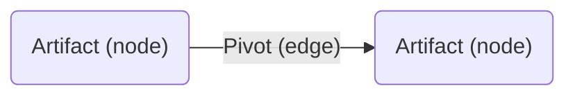

#:material-diamond-stone:Artifacts

This section contains information about various types of artifacts encountered during threat intelligence investigations, such as [malware samples](/artifacts/sample) and [domains](/artifacts/domain). Within this section, you can find explanations about each artifact type and how they relate to malicious cyber activity, as well as real-world examples of artifacts surfaced in the course of historic investigations.

Additionally, every page contains a pivot map showing the various paths analysts can take in order to pivot between different artifact types, explanations of these pivots and accompanying examples, as well as placeholder queries for performing certain pivots via popular [tools](/tools).

Square brackets are added before and after dots in examples of malicious domains and IP addresses — this is a common practice known as "defanging", and is meant to prevent someone from accidentally clicking the domain and connecting to it.

## Organizing principles
In graph terminology, I've chosen to use nodes to represent artifacts — things that exist in reality (i.e., cyberspace) — whereas pivots are represented as egdes between nodes:

Similarly, [fingerprints](/fingerprints) (such as JA4+) are also represented as edges, since they can be considered higher-order abstractions of artifacts (whether lossy or lossless), rather than artifacts in and of themselves. Having said that, certain pivots and fingerprints may eventually "graduate" to artifact status if they are proven to have enough substance.

