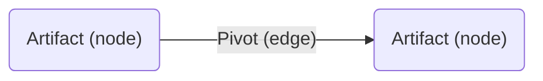
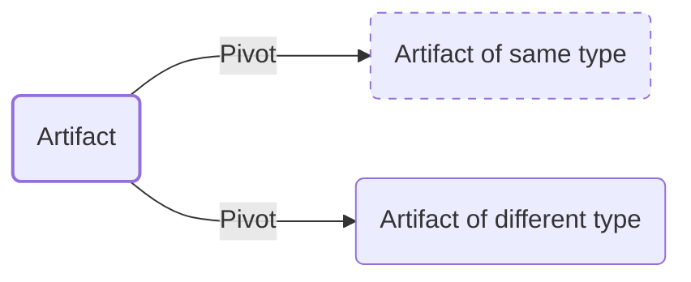
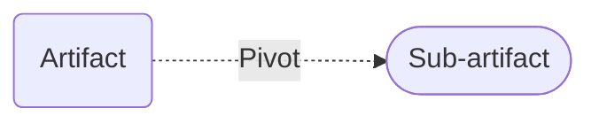

#:material-diamond-stone: Artifacts

This section contains information about various types of artifacts encountered during threat intelligence investigations, such as [malware samples](/artifacts/sample) and [domains](/artifacts/domain). Within this section, you can find explanations about each artifact type and how they relate to malicious cyber activity, as well as real-world examples of artifacts surfaced in the course of historic investigations.

Additionally, every page contains a pivot map showing various paths analysts can take in order to pivot between different artifact types, explanations of these pivots and accompanying examples, as well as placeholder queries for performing certain pivots via popular [tools](/tools).

Looking forward, as both threat intel tradecraft and new pivoting tools are developed, novel and creative pivots are expected to be added to this corpus. Moreover, there are almost certainly past investigations that involved pivots that have yet to be incorporated here, and these will also be added as this backlog is addressed.

!!! note "Placeholder queries"
	Some pivot descriptions throughout this section contain a "Try it out" callout — you can click these to view the syntax of URLs and API calls for various tools that enable the relevant pivot. These contain placeholders for the artifact or observable in question (in the form of `{IP_ADDRESS}`, `{PATH}`, etc.) — simply copy the text and replace the placeholder with the relevant string prior to using the command.

!!! note "Defanging"
	Throughout this section, square brackets are added before and after dots in malicious domains and IP addresses (for example, `evil[.]com` and `6.6.6[.]6`) — this is a common practice known as "defanging", which is meant to prevent someone from accidentally clicking autogenerated hyperlinks and connecting to the malicious server.

## Organizing principles
In graph terminology, I've chosen to use nodes to represent artifacts — things that exist in reality (i.e., cyberspace) — whereas pivots are represented as egdes between nodes:

Similarly, [fingerprints](/fingerprints) (such as [JARM](/fingerprints#jarm-fingerprint)) are also represented as edges, since they can be considered higher-order abstractions of artifacts (whether lossy or lossless), rather than artifacts in and of themselves. Having said that, certain pivots and fingerprints may eventually "graduate" to artifact status if they are proven to have enough substance.

Every page in this section focuses on a particular artifact type, which is represented using a thick border, while other instances of the same artifact type are represented using a dashed border:

Artifacts such as IP addresses can also contain "virtual" sub-artifacts such as servers or clients, which are represented using a dotted line leading to a node with rounded edges:

