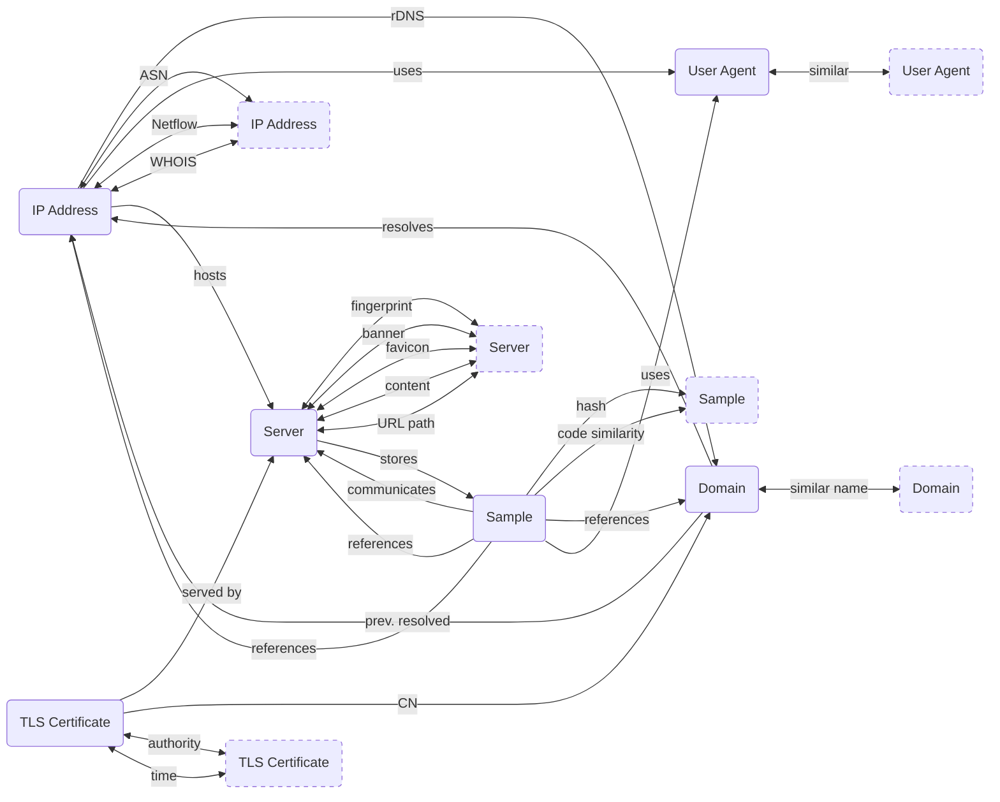

---
hide:
  - navigation
icon: material/map
---

#:material-map:Map

The following diagram shows all pivots between various [artifact](/artifacts) types, as detailed on this website (the list isn't conclusive, and will grow and change as more content is added):

