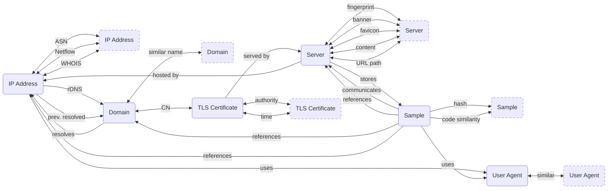

---
hide:
  - navigation
icon: material/map
---

#:material-map:Map

!!! warning "Under Construction"

The following diagram shows all possible pivots between various [artifact](/artifacts) types:

