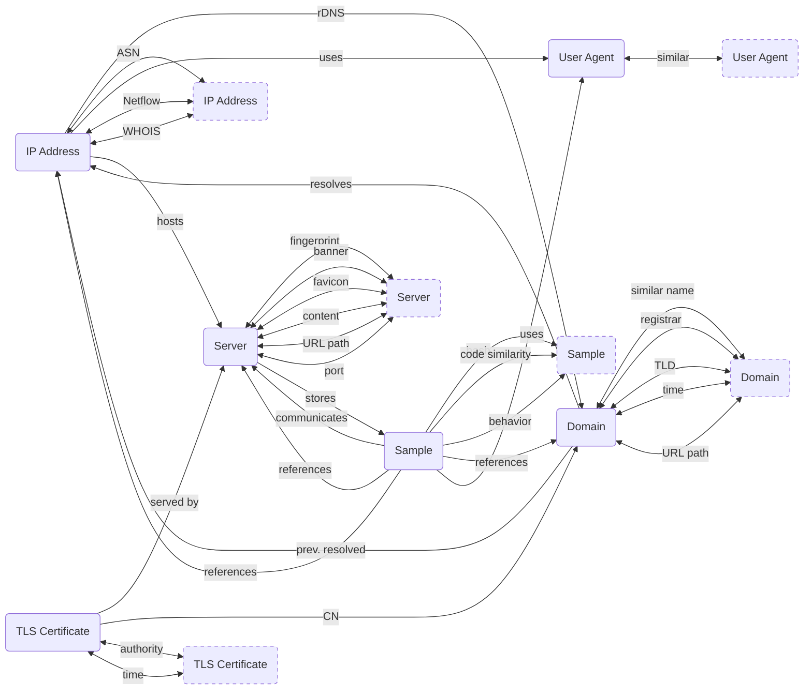

---
hide:
  - navigation
icon: material/map
---

#:material-map:Map

!!! warning "Under Construction"

The following diagram shows all pivots between various [artifact](/artifacts) types, as detailed on this website. Note that the list of pivots and artifacts isn't conclusive, and will grow and change as more content is added (the diagram may take a few seconds to load in your browser if you're visiting this website for the first time):

